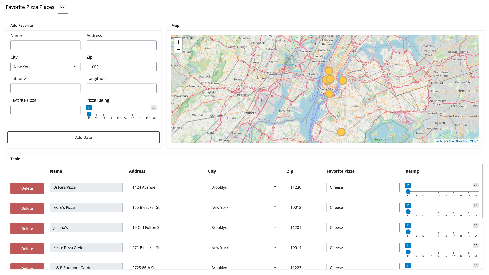

<!-- README.md is generated from README.Rmd. Please edit that file -->

# faketables 

<!-- badges: start -->

[](https://github.com/landeranalytics/faketables/actions/workflows/R-CMD-check.yaml)
<!-- badges: end -->

## Overview

`{faketables}` is a table construction tool that creates and renders
tables using [`Shiny`](https://shiny.posit.co/) inputs, while managing
data inserts, updates, and deletions. Users define the column
definitions using the provided constructors and pass their data, and
`faketables` handles the rest. Because `faketables` is a Shiny module,
it can be used in any Shiny application and excels in applications where
users need to interact with the data in great detail.

## Installation

You can install the development version of faketables from
[GitHub](https://github.com/) with:

``` r
# install.packages("pak")
pak::pak("landeranalytics/faketables")
```

## Usage

Usage is detailed in the [Get Started
Vignette](articles/faketables.html) and an example app about the best
pizza in NYC can be found [here](articles/favorite_pizza.html).


